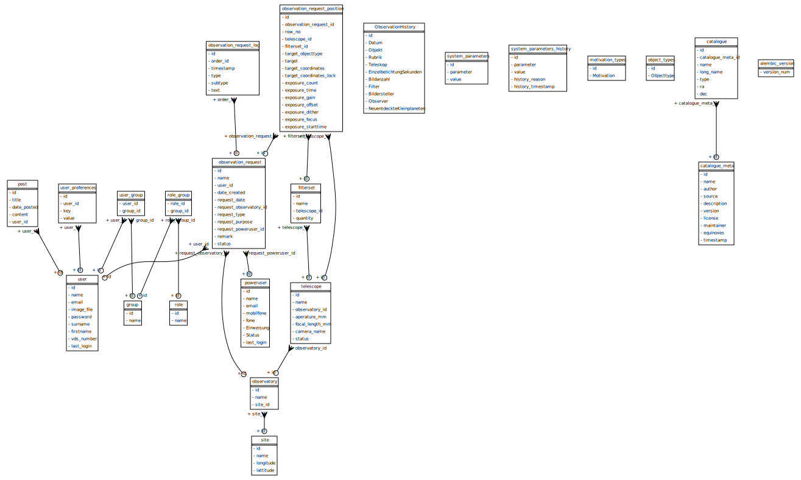

# Daten Modell

## UML Diagram:

### User, Gruppen, Rollen
Ein User kann in mehreren Gruppen sein. Jede Gruppe kann mehrere Rollen besitzen. Beispiel: 
Rolle "admin" in Gruppe "admin". Der folgenden Ausdruck prüft ob der angemeldete Benutzer die Rolle "admin"
besitzt: `current_user.has_role('admin')`

### Site, Observatory, Telescope
Eine Sternwarte (Observatory) befindet sich an einem Ort (Site) und besitzt Telescope auf
der gleichen Montierung. Sie sind also nicht getrennt nutzbar. Akutell haben wir nur 
2 Teleskop in einer Sternwarte an einem Ort. Die Aufteilung in 3 Objekte erleichtert spätere
Erweiterungen.

### ObservationsRequest

Der Beobachtungsantrag erfordert mehr als nur Formulare darzustellen. Die Informationen 
müssen dynamisch angepasst und berechnet werden. Dazu ist zum einen JavaScript Code im 
Browser und zum anderen dynamisch vom Server angefragte Inhalte notwendig.

Der Prozess darf nicht blockieren, d.h. solange keine unerlaubten Vorgänge versucht werden
(z.B. Antrag selbst genehmigen), darf der User alles machen. Eine Genehmigung verhinderte
Umstände sollten jedoch angezeigt werden (warning only). Z.B., wenn der Antrag zu kurzfristig
erfolgt, das Objekt zu tief am Himmel steht oder der Termin schon vergeben ist.

Ein Beobachterantrag wird von einem User gestellt, mehrere weitere User können jedoch beteiligt sein.
Jeder Antrag betrifft ein oder mehrere Teleskope. Es wird eine Nacht gebucht, bzw. 
Zeitabschnitt in dieser Nacht. Der Termin kann bereits belegt sein, dann erscheint eine Warnung.
Mondphase wird automatisch berechnet, ebenso Dämmerungszeiten und Mondaufgang.

Jeder Antrag betrifft ein oder mehrere Objekte, die in diversen Filtern aufgenommen werden. 
Die Koordinaten werden automatisch aus Datenbanken ermittelt oder werden eingegeben.
Benötigte Belichtungszeiten und Anzahl Belichtungen (oder totale Belichtungszeit). Die
verfügbare Zeit wird berechnet.

Ein Antrag befindet sich in einem Zustand: Draft, Submitted, Rejected, Approved, Documented, Deleted.
Rechte:

Draft ändern, Gruppenmitglieder hinzufügen: darf der Antragsteller und alle beteiligten Beobachter. 
Submitten und Gruppenmitglieder entfernen: darf nur der Antragsteller. 
Documented darf nur der Antragsteller setzen.
Reject, Approve: darf nur der Approver.

## Datenbank Schema

## Diagramme aktualisieren

Zum Aktualisieren einfach das Script `create-db-diagrams.py` ausführen.
